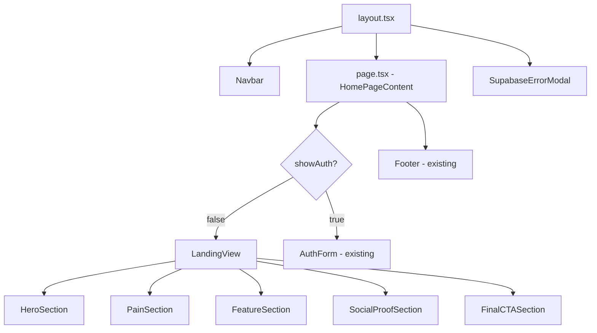

# Design Document: Landing Page Redesign

## Overview

The Writersphere landing page redesign transforms the existing single-component page into a structured, emotionally resonant conversion surface. The current `page.tsx` is a 604-line "use client" component that renders either a minimal hero + 3 feature cards, or the auth form. The redesign adds a Pain section, Social Proof section, and Final CTA section while preserving the existing auth flow exactly.

The page remains a single route (`/`) with a client-side toggle between the landing view and the auth form. No routing changes are needed. The Navbar and Footer are already rendered by `layout.tsx` and are not part of this component.

**Key design decisions:**
- Keep the `showAuth` toggle pattern — it avoids a full navigation and preserves context
- Extract each landing section into its own component file under `src/components/landing/`
- The main `page.tsx` becomes a thin orchestrator that composes these section components
- All new sections use existing CSS classes (`card-feature`, `btn-primary`, `btn-chip`, `animate-fade-in-up`, `animation-delay-*`) and the established color palette

---

## Architecture

The page uses Next.js App Router with a `"use client"` boundary at the page level (required for Supabase session detection and the auth form state). The architecture does not change — we are refactoring the internal structure, not the routing or rendering model.



**State lives in `HomePageContent`** (unchanged):
- `showAuth: boolean` — toggles between landing and auth form
- `mode: "sign_in" | "sign_up"` — pre-selects the auth tab
- All Supabase auth state (session, loading, err, msg, etc.)

`LandingView` receives `onGetStarted: () => void` and `onSignIn: () => void` as props to trigger the auth form with the correct mode pre-selected.

---

## Components and Interfaces

### File Structure

```
src/
  app/
    page.tsx                          # Thin orchestrator (refactored)
  components/
    landing/
      LandingView.tsx                 # Composes all landing sections
      HeroSection.tsx
      PainSection.tsx
      FeatureSection.tsx
      SocialProofSection.tsx
      FinalCTASection.tsx
```

### Component Interfaces

```typescript
// LandingView.tsx
interface LandingViewProps {
  onGetStarted: () => void;   // opens auth form in sign_up mode
  onSignIn: () => void;       // opens auth form in sign_in mode
}

// HeroSection.tsx
interface HeroSectionProps {
  onGetStarted: () => void;
}

// PainSection.tsx
// No props — purely presentational

// FeatureSection.tsx
// No props — purely presentational

// SocialProofSection.tsx
// No props — purely presentational

// FinalCTASection.tsx
interface FinalCTASectionProps {
  onGetStarted: () => void;
}
```

### page.tsx Refactor

The `HomePageContent` function is refactored to:
1. Replace the large inline landing JSX block with `<LandingView onGetStarted={...} onSignIn={...} />`
2. Pass `setMode("sign_up"); setShowAuth(true)` as `onGetStarted`
3. Pass `setMode("sign_in"); setShowAuth(true)` as `onSignIn`
4. Keep the auth form JSX block unchanged

### Section Layouts

**HeroSection** — full-width, centered, above the fold:
- Platform name in Merriweather, large (5xl–7xl), amber/warm accent color `#D4C5B0`
- Tagline in Merriweather italic, slate-300
- Secondary copy line in amber-300/90
- Two CTA buttons: "Start Writing Free" (btn-primary style, amber gradient) + "Explore Writing" (btn-chip, Link to /feed)
- Wrapped in `card-dashboard-main` for the existing glow/border treatment
- `animate-fade-in-up` on headline, `animation-delay-100` on CTAs

**PainSection** — below hero, full-width within the same container:
- Section heading: "You know the feeling." in Merriweather
- 4 struggle cards in a 2×2 grid (mobile: 1-col, md: 2-col)
- Each card: icon + short empathetic phrase, muted styling (slate-400 text, subtle border)
- Transitional pivot line: "Writersphere was built for exactly this." in amber-300, centered
- Uses `animate-fade-in-up` with staggered delays

**FeatureSection** — 3-column grid (md+), single column (mobile):
- Reuses existing organic SVG card backgrounds from current page.tsx
- Each card: icon circle, title in Merriweather, description text
- Cards: "Exploration Over Performance", "Structure for Overthinkers", "Reflection Through Writing"
- Uses existing `card-feature` CSS class with its nth-child border-radius variants

**SocialProofSection** — centered, below features:
- Community signal headline: "Join thousands of writers finding their voice."
- 2–3 testimonial cards in a responsive grid
- Each card: italic quote in Merriweather, attribution line, subtle `card-feature` styling with quotation mark accent
- Placeholder testimonials representing the target audience

**FinalCTASection** — above footer:
- Visually distinct: subtle amber gradient border or `card-dashboard-main` treatment
- Headline: "Your first word is waiting." in Merriweather
- "Start Writing Free" button (btn-primary)
- "Explore first →" secondary link to /feed

---

## Data Models

This feature is purely presentational — no new data models, API calls, or database interactions are introduced. All data is static (hardcoded copy and placeholder testimonials).

The existing auth state model in `HomePageContent` is unchanged:

```typescript
type Mode = "sign_in" | "sign_up";
type Role = "reader" | "writer";

// State (unchanged from current page.tsx)
const [showAuth, setShowAuth] = useState(false);
const [mode, setMode] = useState<Mode>("sign_up");
const [session, setSession] = useState<Session | null>(null);
// ... email, password, displayName, role, loading, msg, err
```

**Static content shape** (for reference, not a runtime model):

```typescript
interface PainItem {
  icon: ReactNode;
  label: string;       // e.g. "The blank page stares back."
}

interface FeatureCard {
  icon: ReactNode;
  title: string;       // max 5 words
  description: string; // max 25 words
}

interface Testimonial {
  quote: string;       // max 30 words
  attribution: string; // e.g. "— A first-time blogger"
}
```

**URL parameter handling** (existing, unchanged):
- `?auth=true` → `setShowAuth(true)` on mount via `useSearchParams`

